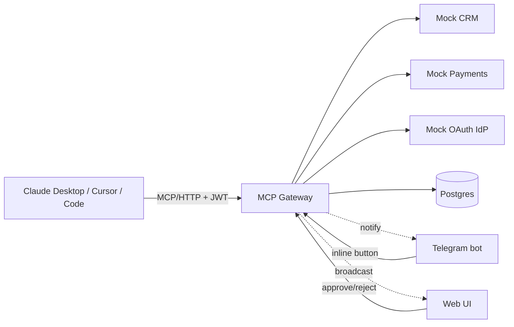

# MCP Gateway

[](https://github.com/Shcherbin96/mcp-gateway/actions/workflows/ci.yml)
[](https://www.python.org/)
[](LICENSE)
[](https://modelcontextprotocol.io)

Production-grade [Model Context Protocol](https://modelcontextprotocol.io) server acting as a security gateway between AI agents and internal company systems.

Every tool call passes through 5 control layers: **authenticate → authorize → approve → execute → audit**.

> Full design — `docs/superpowers/specs/2026-04-29-mcp-gateway-design.md`
> Implementation plan — `docs/superpowers/plans/2026-04-29-mcp-gateway.md`

---

## Why this exists

Most AI-agent demos hand the agent unrestricted access to production systems. That's fine for toys; in real companies it requires a security envelope: who's calling? what are they allowed to do? does this destructive action need a human's approval? where's the audit trail when the regulator asks?

MCP Gateway is that envelope.

---

## Features

- **OAuth 2.1** authentication (with Dynamic Client Registration per the 2026 MCP spec)
- **YAML-based RBAC** policies — `(role, tool) → allow / deny / requires_approval`
- **Human-in-the-loop approvals** for destructive tool calls — Telegram inline buttons + Web UI
- **Append-only audit log** — enforced via Postgres GRANTs and triggers (no UPDATE/DELETE possible)
- **PII redaction** before audit writes (per-tool `redact_fn`)
- **Multi-tenant lite** — every resource scoped by `tenant_id`
- **Retry + circuit breaker** on upstream calls (Tenacity + custom)
- **Full observability** — structured JSON logs (structlog), Prometheus metrics, OpenTelemetry tracing, Grafana dashboard
- **Test pyramid** — unit, integration (testcontainers), E2E (docker-compose), security, mutation, load (locust)
- **One-command local dev** — `docker compose up`
- **Fly.io deployment** with managed Postgres

---

## Architecture



5 layers per tool call:

```
Claude → [Authenticate] → [Authorize] → [Approve?] → [Execute] → [Audit] → Response
```

---

## Quick start

```bash
make install           # creates .venv and installs deps
docker compose up -d   # postgres + mocks + gateway
make seed              # seeds demo tenant + agent + OAuth client
```

Visit:

| URL | What |
|---|---|
| http://localhost:8000/healthz | Health check |
| http://localhost:8000/metrics | Prometheus metrics |
| http://localhost:8000/audit | Audit log UI |
| http://localhost:8000/approvals | Pending approvals UI |
| http://localhost:8000/mcp/tools | MCP tool list (JSON) |
| http://localhost:9000/.well-known/oauth-authorization-server | OAuth metadata |

Run the full observability stack:

```bash
docker compose -f docker-compose.observability.yml up -d
# Prometheus: http://localhost:9090
# Grafana:    http://localhost:3000  (anonymous admin)
# Jaeger:     http://localhost:16686
```

---

## Configure Claude Desktop

After `make seed`, copy the printed `client_id` / `client_secret`, exchange for a token at `http://localhost:9000/token`, then point Claude Desktop at the gateway. See `demo/claude_desktop_config.json`.

---

## Tests

```bash
make test-unit          # fast, no I/O
make test-integration   # spins up Postgres testcontainer
make test-e2e           # full docker-compose stack
make test-security      # bandit + pip-audit + security pytest marks
make cov                # coverage HTML report
```

---

## Deploy to Fly.io

```bash
flyctl auth login
make deploy-mocks       # mock-idp, mock-crm, mock-payments
make deploy-gateway
```

CI deploys on push to `main` (requires `FLY_API_TOKEN` secret).

---

## Documentation

- `docs/architecture.md` — components, sequence diagram for the refund + approval flow, ER diagram for the schema.
- `docs/operations.md` — runbooks: rotate JWKS keys, query the audit log, seed a new tenant, swap mock IdP for a real one, view metrics in Grafana, export audit log to S3 (planned).

---

## License

MIT — see `LICENSE`.
