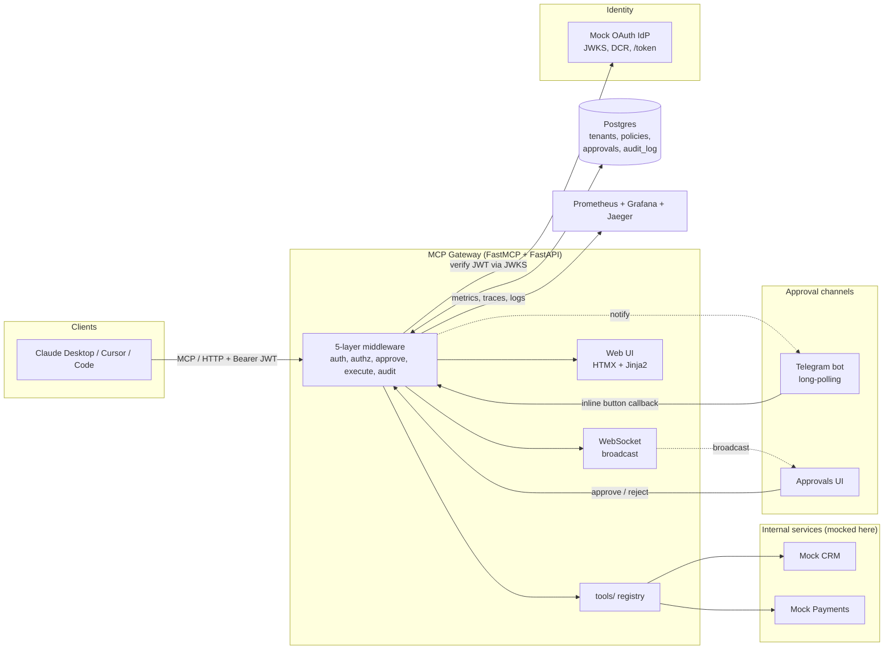
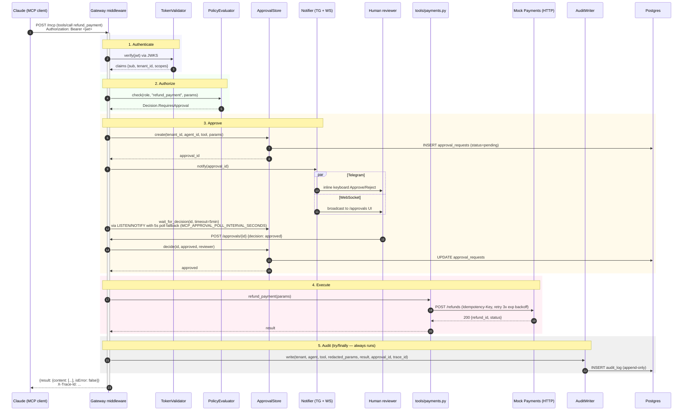

# MCP Gateway — Architecture

This document describes the runtime architecture of MCP Gateway: the components, how a tool call flows through the 5-layer middleware chain, and the persistence model.

For the original design rationale (decisions, trade-offs, scope), see `docs/superpowers/specs/2026-04-29-mcp-gateway-design.md`.

---

## 1. High-level component diagram

MCP Gateway sits between MCP clients (Claude Desktop, Cursor, Code) and a set of internal HTTP services. It owns authentication, authorization, human approval, audit, and observability — application logic stays in the upstream services.



### Component responsibilities

| Component | Source | Responsibility |
|---|---|---|
| `gateway/server.py` | FastMCP + FastAPI app entrypoint | Wires middleware chain, mounts MCP, OAuth, web routes |
| `gateway/middleware/` | 5 chained middlewares | `authenticate` → `authorize` → `approve` → `execute` → `audit` |
| `gateway/auth/` | `TokenValidator`, OAuth server | JWT validation against JWKS, DCR endpoint |
| `gateway/policy/` | `PolicyEvaluator`, YAML loader | `(role, tool, params) → allow / deny / requires_approval` |
| `gateway/approval/` | `ApprovalStore`, notifiers | Pending-approval CRUD, Telegram + WS notifications, timeout reaper |
| `gateway/audit/` | Append-only writer + reader | Writes immutable audit rows, exposes JSON API for SIEM |
| `gateway/tools/` | Registry + implementations | Each tool declares `destructive?`, `redact_fn`, schema |
| `gateway/tenants/` | SQLAlchemy middleware | Injects `tenant_id` filter into every query |
| `gateway/observability/` | structlog, prometheus-client, OpenTelemetry | Logs, metrics, traces |
| `mocks/crm/`, `mocks/payments/` | Standalone FastAPI services | Realistic upstream behaviour (latency, 5xx, API keys) |
| `mocks/idp/` | Standalone FastAPI service | OAuth 2.1 Authorization Server with DCR + JWKS |

### Pluggable interfaces

Everything that is environment-specific has an interface so the production deployment can swap implementations without touching the middleware chain:

- `TokenValidator` — Mock IdP today, any RS256 IdP via JWKS URL tomorrow.
- `PolicyStore` — YAML on disk today, database-backed UI tomorrow.
- `ApprovalNotifier` — Telegram + WebSocket today, Slack/Teams tomorrow.
- `AuditSink` — Postgres today, S3/BigQuery/Splunk tomorrow.

---

## 2. Sequence diagram — refund + approval flow

This is the canonical destructive-tool path: a `refund_payment` call from an authenticated agent that requires human approval before execution. Every layer must succeed and every outcome is audited.



### Failure outcomes (also audited)

| Stage | Failure | Audit `result_status` | HTTP / MCP response |
|---|---|---|---|
| 1 | Invalid JWT, none-alg, expired | `auth_failed` | 401, OAuth error per RFC 6750 |
| 2 | Role lacks permission | `policy_denied` | 403, MCP error `-32001` |
| 3 | Reviewer rejects | `approval_rejected` | 403, MCP error with reason |
| 3 | No decision in 5 min | `approval_timeout` | 408, MCP error |
| 4 | Upstream 5xx after retries | `upstream_unavailable` | 502, MCP error |
| 4 | Upstream 4xx | `upstream_error` | passes through, MCP error |
| 5 | Audit write itself fails | `internal_error` | 500 + alarm, never silently dropped |

The audit row is the system of record: even rejected/denied/error paths produce one row per call, keyed by `trace_id`.

---

## 3. ER diagram — Postgres schema

Multi-tenant by `tenant_id` foreign key on every owned table. RBAC is `(role → role_permissions → tool)`. Approvals are tracked separately and linked from the audit row when one occurred. `audit_log` is append-only — enforced both by Postgres GRANTs (`REVOKE UPDATE, DELETE FROM mcp_app`) and a `BEFORE UPDATE OR DELETE` trigger that raises an exception.

```mermaid
erDiagram
    tenants ||--o{ oauth_clients : "owns"
    tenants ||--o{ agents : "owns"
    tenants ||--o{ roles : "defines"
    tenants ||--o{ approval_requests : "scopes"
    tenants ||--o{ audit_log : "scopes"

    roles ||--o{ role_permissions : "grants"
    roles ||--o{ agents : "assigned to"

    agents ||--o{ approval_requests : "requested by"
    agents ||--o{ audit_log : "performed by"

    approval_requests ||--o| audit_log : "linked from (nullable)"

    tenants {
        uuid id PK
        text name
        timestamp created_at
    }

    oauth_clients {
        uuid id PK
        uuid tenant_id FK
        text client_id "UNIQUE"
        text client_secret_hash
        text_array redirect_uris
        timestamp created_at
    }

    agents {
        uuid id PK
        uuid tenant_id FK
        text name
        uuid role_id FK
        text owner_email
    }

    roles {
        uuid id PK
        uuid tenant_id FK
        text name "UNIQUE per tenant"
    }

    role_permissions {
        uuid role_id PK_FK
        text tool_name PK
        boolean requires_approval
    }

    approval_requests {
        uuid id PK
        uuid tenant_id FK
        uuid agent_id FK
        text tool
        jsonb params_json
        text status "pending|approved|rejected|timeout"
        timestamp requested_at
        timestamp decided_at
        text decided_by
        text decision_reason
    }

    audit_log {
        bigserial id PK
        uuid tenant_id FK
        uuid agent_id FK
        text tool
        jsonb params_json "PII-redacted"
        text result_status "success|denied|rejected|timeout|error"
        jsonb result_json
        uuid approval_id FK "nullable"
        text trace_id
        timestamp created_at
    }
```

### Indexes

- `audit_log (tenant_id, created_at DESC)` — UI listing per tenant.
- `audit_log (agent_id, created_at DESC)` — per-agent investigations.
- `audit_log (trace_id)` — correlation with traces from Jaeger.
- `approval_requests (tenant_id, status, requested_at)` — pending-approvals UI.
- `oauth_clients (client_id)` — UNIQUE, lookup at `/token`.

### Append-only enforcement

```sql
-- Migration: 0002_audit_immutable.sql
GRANT INSERT, SELECT ON audit_log TO mcp_app;
REVOKE UPDATE, DELETE ON audit_log FROM mcp_app;

CREATE OR REPLACE FUNCTION audit_log_no_modify() RETURNS trigger AS $$
BEGIN
  RAISE EXCEPTION 'audit_log is append-only';
END;
$$ LANGUAGE plpgsql;

CREATE TRIGGER audit_log_no_modify
  BEFORE UPDATE OR DELETE ON audit_log
  FOR EACH ROW EXECUTE FUNCTION audit_log_no_modify();
```

A Postgres superuser can still bypass GRANTs, so the trigger is the second line of defence and is exercised by an integration test.

---

## 4. Cross-cutting concerns

- **Tenant isolation.** `gateway/tenants/middleware.py` reads `tenant_id` from the JWT, sets it on `request.state`, and an SQLAlchemy event hook injects `WHERE tenant_id = :current_tenant` into every query. Cross-tenant queries throw at the ORM layer.
- **PII redaction.** Each tool entry in `gateway/tools/registry.py` declares `redact_fn(params) → params`. Redaction runs *before* the audit write — the raw value never reaches `audit_log`.
- **Idempotency on retry.** Upstream calls that mutate state include an `Idempotency-Key` header derived from `trace_id`. Read-only calls retry freely; mutations rely on the key.
- **Circuit breaker.** Tenacity-backed retry with a small custom breaker per upstream service: 5 consecutive failures → open for 30s, then half-open probe.
- **Trace propagation.** OpenTelemetry assigns the trace ID at ingress; it flows into every span, log line, audit row, and is returned to the client in the `X-Trace-Id` response header.

---

## 5. Streamable HTTP transport

The gateway exposes the MCP **Streamable HTTP** transport (spec revision `2025-06-18`) at a single endpoint:

```
POST /mcp/rpc
Content-Type: application/json
Authorization: Bearer <jwt>            # required for tools/call
Mcp-Session-Id: <opaque>               # echoed; minted on initialize
```

The body is a JSON-RPC 2.0 request. Supported methods:

| Method | Purpose | Notes |
|---|---|---|
| `initialize` | Handshake | Returns `protocolVersion`, capabilities `{tools: {}}`, `serverInfo`. Mints a fresh `Mcp-Session-Id` response header. |
| `notifications/initialized` | Client → server notification | No response body, HTTP 202. |
| `tools/list` | Tool catalog | Same content as the legacy `GET /mcp/tools`. |
| `tools/call` | Invoke a tool | Runs the full 5-layer pipeline. Result wraps the upstream payload as `{content: [{type: "text", text: "<json>"}], isError: <bool>}`. |
| `ping` | Liveness | `{}` result. |

Errors travel inside the JSON-RPC envelope (`{jsonrpc, id, error: {code, message, data}}`) with HTTP 200, except for unparseable bodies (HTTP 400) and `GET /mcp/rpc` (HTTP 405 — server-initiated streaming is not implemented). Authentication, authorization, approval, and audit failures all surface through the standard pipeline result statuses; the transport renders them into either an HTTP status (legacy REST) or `isError: true` (MCP).

The legacy REST endpoints `GET /mcp/tools` and `POST /mcp/call/{tool_name}` remain available and share the same `invoke_tool` pipeline helper — they are a strict subset of what `/mcp/rpc` exposes.

For client configuration examples (stdio proxy + direct HTTP), see `demo/claude_desktop_config.json`.

---

## 6. References

- Spec: `docs/superpowers/specs/2026-04-29-mcp-gateway-design.md`
- Plan: `docs/superpowers/plans/2026-04-29-mcp-gateway.md`
- Operations runbooks: `docs/operations.md`
- MCP protocol: https://modelcontextprotocol.io
